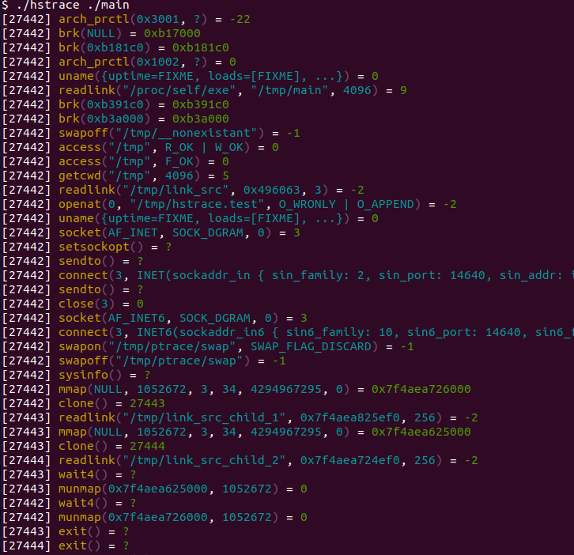

Syscall tracing CLI & library
==================================================

[](https://github.com/blaind/hstrace/actions?query=branch%3Amaster)
[](https://crates.io/crates/hstrace)
[](https://docs.rs/hstrace)

[](https://github.com/blaind/hstrace)

Syscall tracing from command line and as a library. See the design draft: https://github.com/blaind/hstrace/blob/master/docs/01_hstrace_plan.md

Requires Linux kernel 5.3 or later (uses `PTRACE_GET_SYSCALL_INFO` API)

**This is a WIP implementation, and not production ready. Might not be finished**. Multiple issues exist: 1) codebase is not ready to be expanded yet, major refactoring is needed especially for the `AV` and `Value` structs to be more generic, 2) attach to process is not instant, some calls are missed at beginning, 3) not all syscalls are implemented, 4) cross-platform support is missing, 5) as a comparison, `strace` codebase is over 200k LoC in total (incl comments), so finishing the work is quite an undertaking

## Prequisites

Install dependencies:
```
$ apt-get install libclang1
```

## Command line tool



Install the binary:
```
$ cargo install hstrace
```

Run the command
```
$ hstrace -h

hstrace for stracing processes

USAGE:
    hstrace [FLAGS] [OPTIONS] <prog>...

FLAGS:
    -h, --help         Prints help information
        --no-follow    Do not follow child processes as they are created
    -V, --version      Prints version information

OPTIONS:
    -e <expr>           Expression
    -m <mode>           Run mode [default: strace]
    -o <file>           Save output to a file instead of stderr. If suffix is `.json`, will be stored in JSON-format
                        (format subject to change)
    -p <pid>            PID to trace
    -s <strsize>        Maximum length of printable strings [default: 32]

ARGS:
    <prog>...    Program to strace
```

## Stracing library

### Usage

Add this to your `Cargo.toml`:

```toml
[dependencies]
hstrace = "0.0.4"
```

And this to your code:

```rust
use hstrace::prelude::*;

fn main() {
    let mut tracer = HStraceBuilder::new().program("ps").arg("uxaw").build();

    tracer.start().unwrap();

    for syscall in tracer.iter_as_syscall() {
        match syscall.name {
            hstrace::Ident::Openat | hstrace::Ident::Fstat | hstrace::Ident::Stat => {
                println!("File operation detected: {:?}", syscall);
            }

            hstrace::Ident::Socket | hstrace::Ident::Bind | hstrace::Ident::Connect => {
                println!("Network operation detected: {:?}", syscall);
            }

            _ => (),
        }
    }
}
```

See [examples/03_match_syscall_name.rs](examples/03_match_syscall_name.rs) and other [examples](examples).

#### License

<sup>
Licensed under either of <a href="LICENSE-APACHE">Apache License, Version
2.0</a> or <a href="LICENSE-MIT">MIT license</a> at your option.
</sup>

<br>

<sub>
Unless you explicitly state otherwise, any contribution intentionally submitted
for inclusion in this crate by you, as defined in the Apache-2.0 license, shall
be dual licensed as above, without any additional terms or conditions.
</sub>
