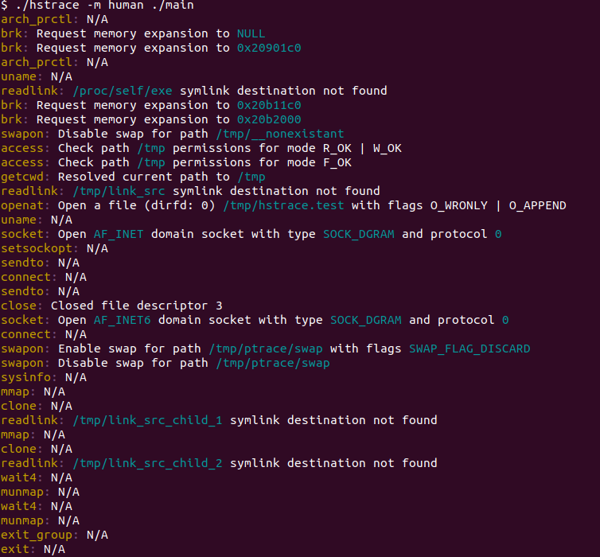

# HStrace plan

**Comments on this plan are welcome on Github issue: https://github.com/blaind/hstrace/issues/1**

This is a draft document for API and rationale of the hstrace library.

In short, hstrace would:
* be an easy-to-use wrapper for Linux kernel ptracing API
* be embeddable as a rust-library or usable from CLI
* be opinionated on output, and geared towards system admins and software developers for embedding syscall-tracing capabilities into their software
* initially implement detailed info on a limited subset of syscall API (likely on the range of ~40-80 most relevant syscalls of the total 300+)
* initially target x86_64 Linux on Linux 5.3.+ kernels (because 5.3. contains PTRACE_GET_SYSCALL_INFO API)

Library features:
* usable as a Rust -library
* easy to use API

CLI features:
* colorized output
* output in strace-like format and also human-readable format
* possibly grouping of syscalls (e.g. file-related operations per each file)
* filtering of calls per group (show only network calls, file-related calls etc.)

Other features:
* by default, automatically attach to child processes of tracee ("the process to be traced")

# Usage

## From CLI

CLI would output colorized syscall-output with (resolved) parameters:


Optionally, it could also output "human-readable" output:




## As a library
Hstrace can be used as a library in following way:
```rust
use hstrace::prelude::*;

fn main() {
    // Start the tracer instance, can be started with
    // .program & .arg (or .args if multiple) methods.
    // Also .pid(usize) works
    let mut tracer = HStrace::new()
        .program("touch")
        .arg("/tmp/HStrace_example.txt")
        .start()
        .unwrap();

    // Iteration of output
    for call in tracer.iter_as_syscall() {
        // inner contains enum of specific syscall
        match call.inner {
            // match the specific syscall
            InnerCall::openat(o) => {
                // each syscall contains syscall-relevant fields
                if o.flags.contains(types::OpenatMode::O_WRONLY) {
                    println!("File {} opened in write-mode ({:?})", o.pathname, o.flags);
                }
            }

            // another call (readlink, which resolves synlink src to dst)
            InnerCall::readlink(o) => {
                println!("Readlink called: {:?} links to {:?}", o.src, o.dst);
            }

            _ => (),
        }

        // one can also match for syscalls
        match call.syscall {
            Call::openat | Call::fstat | Call::stat => {
                println!("File operation detected: {:?}", call);
            }

            Call::socket | Call::bind | Call::connect => {
                println!("Network operation detected: {:?}", call);
            }

            _ => (),
        }
}
```

Iterator outputs following struct:

```rust
pub struct Syscall {
    // currently designed
    pub syscall: Call,
    pub inner: InnerCall,

    // Possibly for signaling about the security implications of the call? E.g. opening a file in home-folder at write-mode would be flagged to danger
    // CallMode::Danger, CallMode::Warning, CallMode::Info
    pub mode: CallMode,

    // Possibly: a category of a call
    // e.g. Category::Network, Category::File, Category::SHM, etc.
    pub category: Category,
}
```

Where the values would be as follows:

```rust
enum Call {
    readlink,
    connect,
    fstat,
    ... etc
}

enum InnerCall {
    readlink(Readlink),
    connect(Connect),
    fstat(Fstat),
    ... etc
}

```

each InnerCall would (optionally, if implemented in code) contain syscall-specific structs with input-output values.

For example, Readlink would be as follows:

```rust
pub struct Readlink {
    /// Source file
    pub src: String,

    /// Destination file
    pub dst: Option<String>,

    // To be decided: how to integrate exit codes / success status
}
```

# Further reading

## Further ideas

* Using library as a security module (e.g. preventing access to specific calls). Probably not feasible because of TOCTOU-problems (see https://en.wikipedia.org/wiki/Time-of-check_to_time-of-use)

## Further reading
* http://man7.org/linux/man-pages/man2/ptrace.2.html
